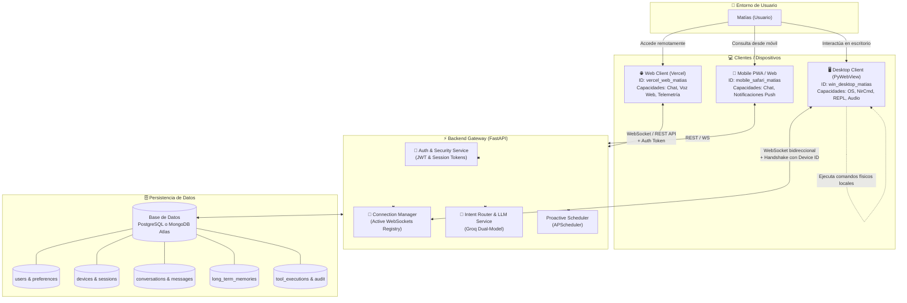
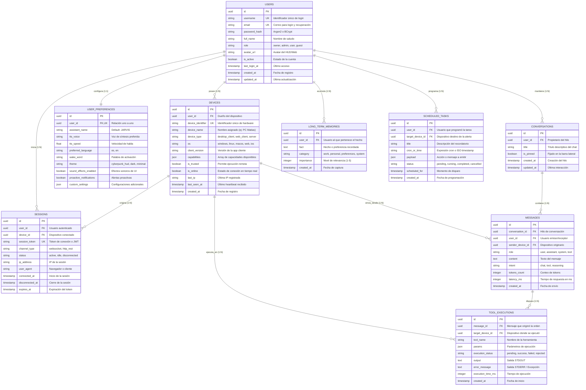
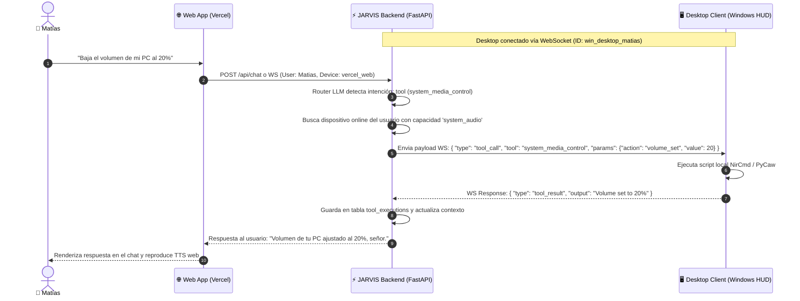

# 🧠 JARVIS OS — Diseño de Base de Datos y Modelo Multidispositivo

Este documento define la arquitectura de datos, el diagrama Entidad-Relación (ERD), el flujo de conexión multidispositivo y el diccionario de datos para **JARVIS**. Está diseñado para transformar el asistente en una aplicación completa con soporte para usuarios, múltiples dispositivos (Desktop HUD, Web en Vercel, Servidor) y sesiones concurrentes.

---

## 1. Topología de Conexión Multidispositivo

El siguiente diagrama ilustra cómo interactúan los diferentes clientes con el backend y la base de datos:



---

## 2. Diagrama Entidad-Relación (ERD)



---

## 3. Flujo de Ejecución Remota entre Dispositivos (UX Caso Vercel Web -> Desktop)

Uno de los mayores beneficios de tener `devices` separados de `users` es la capacidad de controlar el hardware de tu casa/oficina desde la web en Vercel:



---

## 4. Diccionario de Tablas y Esquema

### 4.1. `users` (Usuarios y Cuentas)
Gestiona la identidad del propietario o invitados que interactúan con el sistema.

| Campo | Tipo SQL / BSON | Restricciones | Propósito UX / Sistema |
| :--- | :--- | :--- | :--- |
| `id` | `UUID` | **PK**, Not Null | Identificador inmutable del usuario. |
| `username` | `VARCHAR(50)` | **UNIQUE, NOT NULL** | Nombre de usuario para autenticarse. |
| `email` | `VARCHAR(255)` | **UNIQUE, NOT NULL** | Correo electrónico. |
| `password_hash` | `VARCHAR(255)` | **NOT NULL** | Hash de la contraseña (BCrypt / Argon2). |
| `full_name` | `VARCHAR(100)` | **NOT NULL** | Nombre con el que JARVIS saluda al usuario. |
| `role` | `VARCHAR(20)` | **DEFAULT 'user'** | Niveles: `'owner'`, `'admin'`, `'user'`, `'guest'`. |
| `avatar_url` | `VARCHAR(500)` | Nullable | Imagen de perfil para el HUD y la Web. |
| `is_active` | `BOOLEAN` | **DEFAULT TRUE** | Permite desactivar cuentas sin borrarlas. |
| `last_login_at` | `TIMESTAMP` | Nullable | Registro de último acceso exitoso. |
| `created_at` | `TIMESTAMP` | **DEFAULT NOW()** | Momento de registro. |
| `updated_at` | `TIMESTAMP` | **DEFAULT NOW()** | Última modificación de perfil. |

> [!TIP]
> El rol `'owner'` otorga privilegios absolutos para ejecutar herramientas destructivas de terminal (Bash/PowerShell) sin restricciones.

---

### 4.2. `user_preferences` (Personalización del Asistente)
Configuración de la experiencia de usuario personalizada para cada cuenta.

| Campo | Tipo SQL / BSON | Restricciones | Propósito UX / Sistema |
| :--- | :--- | :--- | :--- |
| `id` | `UUID` | **PK**, Not Null | ID de la preferencia. |
| `user_id` | `UUID` | **FK (users.id), UNIQUE** | Relación 1:1 estricta con el usuario. |
| `assistant_name` | `VARCHAR(50)` | **DEFAULT 'JARVIS'** | Nombre con el que responde la IA. |
| `tts_voice` | `VARCHAR(100)` | **DEFAULT 'es-ES-AlvaroNeural'** | Voz de Edge TTS o local. |
| `tts_speed` | `FLOAT` | **DEFAULT 1.0** | Velocidad de lectura del asistente. |
| `preferred_language`| `VARCHAR(10)` | **DEFAULT 'es'** | Idioma principal de conversación. |
| `wake_word` | `VARCHAR(50)` | **DEFAULT 'jarvis'** | Palabra de activación local en Vosk. |
| `theme` | `VARCHAR(50)` | **DEFAULT 'cyberpunk_hud'**| Estilo visual (`cyberpunk_hud`, `neon_minimal`, etc.). |
| `sound_effects_enabled`| `BOOLEAN` | **DEFAULT TRUE** | Si reproduce pitidos/efectos de HUD. |
| `proactive_notifications`| `BOOLEAN` | **DEFAULT TRUE** | Autorización para mensajes no solicitados. |
| `custom_settings`| `JSONB` / `JSON` | **DEFAULT '{}'** | Configuraciones experimentales o futuras. |

---

### 4.3. `devices` (Dispositivos Registrados y Conectividad)
Es el núcleo de la arquitectura distribuida. Permite saber qué dispositivos tiene el usuario y qué puede hacer cada uno.

| Campo | Tipo SQL / BSON | Restricciones | Propósito UX / Sistema |
| :--- | :--- | :--- | :--- |
| `id` | `UUID` | **PK**, Not Null | ID del dispositivo. |
| `user_id` | `UUID` | **FK (users.id), NOT NULL** | Propietario del dispositivo. |
| `device_identifier` | `VARCHAR(100)`| **UNIQUE, NOT NULL** | Hash de hardware o identificador persistente. |
| `device_name` | `VARCHAR(100)`| **NOT NULL** | Nombre amigable: *"Desktop Principal"*, *"MacBook Air"*, *"Web Vercel"*. |
| `device_type` | `VARCHAR(30)` | **NOT NULL** | Enum: `'desktop_client'`, `'web_client'`, `'server'`, `'mobile'`. |
| `os` | `VARCHAR(30)` | **NOT NULL** | `'windows'`, `'linux'`, `'macos'`, `'web'`, `'android'`, `'ios'`. |
| `client_version` | `VARCHAR(20)` | Nullable | Versión de software instalada. |
| `capabilities` | `JSONB` / `ARRAY`| **NOT NULL** | Lista de capacidades que soporta el dispositivo: `["terminal_repl", "ui_render", "audio_record", "skills_executor", "system_audio"]`. |
| `is_trusted` | `BOOLEAN` | **DEFAULT FALSE** | Si tiene permiso de ejecutar scripts de sistema sin pedir confirmación. |
| `is_online` | `BOOLEAN` | **DEFAULT FALSE** | Indicador de conexión en vivo. |
| `last_ip` | `VARCHAR(45)` | Nullable | Dirección IP (IPv4 o IPv6). |
| `last_seen_at` | `TIMESTAMP` | **DEFAULT NOW()** | Fecha y hora del último ping. |
| `created_at` | `TIMESTAMP` | **DEFAULT NOW()** | Fecha de vinculación inicial. |

> [!IMPORTANT]
> Un cliente web alojado en Vercel reportará sus `capabilities` como: `["ui_render", "audio_record", "web_chat"]`.
> El backend sabrá que **no** puede enviarle órdenes directas de sistema como `pycaw` o scripts PowerShell a ese cliente web, sino que debe redirigirlas a un `desktop_client` activo.

---

### 4.4. `sessions` (Sesiones Activas y Tokens de WebSocket)
Rastrea las conexiones abiertas con el `ConnectionManager` de FastAPI.

| Campo | Tipo SQL / BSON | Restricciones | Propósito UX / Sistema |
| :--- | :--- | :--- | :--- |
| `id` | `UUID` | **PK**, Not Null | Identificador de la sesión. |
| `user_id` | `UUID` | **FK (users.id), NOT NULL** | Usuario autenticado. |
| `device_id` | `UUID` | **FK (devices.id), NOT NULL** | Dispositivo que mantiene abierta la conexión. |
| `session_token` | `VARCHAR(500)`| **UNIQUE, NOT NULL** | Token JWT de sesión para validar en handshake. |
| `channel_type` | `VARCHAR(20)` | **NOT NULL** | `'websocket'` o `'http_rest'`. |
| `status` | `VARCHAR(20)` | **DEFAULT 'active'** | `'active'`, `'idle'`, `'disconnected'`. |
| `ip_address` | `VARCHAR(45)` | Nullable | IP de origen de la conexión. |
| `user_agent` | `VARCHAR(255)`| Nullable | Identificador del navegador o cliente. |
| `connected_at` | `TIMESTAMP` | **DEFAULT NOW()** | Inicio de conexión. |
| `disconnected_at`| `TIMESTAMP` | Nullable | Cierre de conexión. |
| `expires_at` | `TIMESTAMP` | **NOT NULL** | Expiración del token. |

---

### 4.5. `conversations` y `messages` (Historial de Conversación Multidispositivo)
Sustituye la estructura monolítica actual de `memory_service.py` para permitir la sincronización entre plataformas.

#### `conversations`
| Campo | Tipo SQL / BSON | Restricciones | Propósito UX / Sistema |
| :--- | :--- | :--- | :--- |
| `id` | `UUID` | **PK**, Not Null | ID del hilo. |
| `user_id` | `UUID` | **FK (users.id), NOT NULL** | Usuario propietario del hilo. |
| `title` | `VARCHAR(200)`| **DEFAULT 'Nueva Conversación'** | Título generado por el LLM o fijado por el usuario. |
| `is_pinned` | `BOOLEAN` | **DEFAULT FALSE** | Conversaciones fijadas en la interfaz. |
| `created_at` | `TIMESTAMP` | **DEFAULT NOW()** | Creación del hilo. |
| `updated_at` | `TIMESTAMP` | **DEFAULT NOW()** | Última actualización de mensajes. |

#### `messages`
| Campo | Tipo SQL / BSON | Restricciones | Propósito UX / Sistema |
| :--- | :--- | :--- | :--- |
| `id` | `UUID` | **PK**, Not Null | ID del mensaje. |
| `conversation_id`| `UUID` | **FK (conversations.id), NOT NULL** | Hilo al que pertenece. |
| `user_id` | `UUID` | **FK (users.id), NOT NULL** | Usuario autor o receptor. |
| `sender_device_id`| `UUID` | **FK (devices.id), Nullable** | Dispositivo físico desde donde se habló/escribió. |
| `role` | `VARCHAR(20)` | **NOT NULL** | `'user'`, `'assistant'`, `'system'`, `'tool'`. |
| `content` | `TEXT` | **NOT NULL** | Texto del mensaje. |
| `intent` | `VARCHAR(30)` | Nullable | Clasificación del router (`'chat'`, `'tool'`, `'reasoning'`). |
| `tokens_count` | `INTEGER` | Nullable | Métrica de consumo del modelo LLM. |
| `latency_ms` | `INTEGER` | Nullable | Tiempo de respuesta del modelo en milisegundos. |
| `created_at` | `TIMESTAMP` | **DEFAULT NOW()** | Momento de emisión. |

---

### 4.6. `tool_executions` (Auditoría y Cache de Herramientas)
Registra cada comando ejecutado en la máquina para auditoría, seguridad y reuso de resultados.

| Campo | Tipo SQL / BSON | Restricciones | Propósito UX / Sistema |
| :--- | :--- | :--- | :--- |
| `id` | `UUID` | **PK**, Not Null | ID de la ejecución. |
| `message_id` | `UUID` | **FK (messages.id), Nullable** | Mensaje que disparó la herramienta. |
| `target_device_id`| `UUID` | **FK (devices.id), NOT NULL** | Dispositivo donde se ejecutó físicamente el comando. |
| `tool_name` | `VARCHAR(100)`| **NOT NULL** | Nombre de la tool (ej: `system_media_control`, `repl`). |
| `params` | `JSONB` / `JSON`| **NOT NULL** | Argumentos recibidos. |
| `execution_status`| `VARCHAR(20)`| **NOT NULL** | `'pending'`, `'success'`, `'failed'`, `'rejected'`. |
| `output` | `TEXT` | Nullable | Respuesta textual devuelta por el sistema operativo. |
| `error_message` | `TEXT` | Nullable | Error capturado en caso de fallo. |
| `execution_time_ms`| `INTEGER` | Nullable | Latencia de ejecución en la máquina. |
| `created_at` | `TIMESTAMP` | **DEFAULT NOW()** | Inicio de la ejecución. |

---

### 4.7. `long_term_memories` (Memoria a Largo Plazo por Usuario)
Consolida el aprendizaje de JARVIS sobre el usuario para personalizar respuestas futuras.

| Campo | Tipo SQL / BSON | Restricciones | Propósito UX / Sistema |
| :--- | :--- | :--- | :--- |
| `id` | `UUID` | **PK**, Not Null | ID del recuerdo. |
| `user_id` | `UUID` | **FK (users.id), NOT NULL** | Usuario al que corresponde el hecho. |
| `fact` | `TEXT` | **NOT NULL** | Hecho aprendido (ej: *"Prefiere respuestas breves y código en Python"*). |
| `category` | `VARCHAR(50)` | **DEFAULT 'general'** | `'preferences'`, `'work'`, `'system'`, `'personal'`. |
| `importance` | `INTEGER` | **DEFAULT 3** | Puntuación de relevancia (1 al 5). |
| `created_at` | `TIMESTAMP` | **DEFAULT NOW()** | Momento en que se registró el aprendizaje. |

---

### 4.8. `scheduled_tasks` (Persistencia del Scheduler)
Permite que recordatorios programados persistan incluso si el servidor se reinicia.

| Campo | Tipo SQL / BSON | Restricciones | Propósito UX / Sistema |
| :--- | :--- | :--- | :--- |
| `id` | `UUID` | **PK**, Not Null | ID de la tarea. |
| `user_id` | `UUID` | **FK (users.id), NOT NULL** | Usuario objetivo. |
| `target_device_id`| `UUID` | **FK (devices.id), Nullable** | Dispositivo específico para alertar (o NULL para todos). |
| `title` | `VARCHAR(200)`| **NOT NULL** | Nombre del recordatorio o evento. |
| `cron_or_time` | `VARCHAR(100)`| **NOT NULL** | Timestamp programado o expresión cron. |
| `payload` | `JSONB` / `JSON`| **NOT NULL** | Datos de la acción a ejecutar (mensaje de voz, comando, alerta). |
| `status` | `VARCHAR(20)` | **DEFAULT 'pending'** | `'pending'`, `'running'`, `'completed'`, `'cancelled'`. |
| `scheduled_for` | `TIMESTAMP` | **NOT NULL** | Fecha y hora exacta de disparo. |
| `created_at` | `TIMESTAMP` | **DEFAULT NOW()** | Fecha de registro. |

---

## 5. Estrategia de Índices para Alto Rendimiento

Para garantizar tiempos de respuesta ultrarrápidos (<50ms en consultas de contexto):

```sql
-- Índices para búsqueda de usuarios y login
CREATE UNIQUE INDEX idx_users_username ON users (username);
CREATE UNIQUE INDEX idx_users_email ON users (email);

-- Índices para resolución rápida de dispositivos y estado online
CREATE INDEX idx_devices_user_id ON devices (user_id);
CREATE UNIQUE INDEX idx_devices_identifier ON devices (device_identifier);
CREATE INDEX idx_devices_online_status ON devices (user_id, is_online);

-- Índices para recuperación de historial en Sliding Window
CREATE INDEX idx_messages_conversation_time ON messages (conversation_id, created_at DESC);
CREATE INDEX idx_messages_user_time ON messages (user_id, created_at DESC);

-- Índices para memoria a largo plazo (búsqueda de texto)
CREATE INDEX idx_memories_user ON long_term_memories (user_id);

-- Índices para sesiones activas
CREATE UNIQUE INDEX idx_sessions_token ON sessions (session_token);
CREATE INDEX idx_sessions_active ON sessions (user_id, status);
```

---

## 6. Comparativa de Implementación Técnica

| Criterio | Opción A: PostgreSQL (Supabase / Neon / Local) | Opción B: MongoDB Atlas / Local (Motor) |
| :--- | :--- | :--- |
| **Integridad Referencial** | Nativa (`ON DELETE CASCADE`, claves foráneas estrictas). | Debe ser gestionada a nivel de código de aplicación en FastAPI. |
| **Autenticación y Sesiones** | Estándar de la industria para JWT, roles y permisos. | Requiere colecciones separadas con índices únicos en BSON. |
| **Compatibilidad con Vercel** | Excelente con Connection Pooling (Neon / Supabase). | Excelente vía MongoDB Atlas Serverless M0. |
| **Impacto en el Código Actual** | Requiere añadir SQLAlchemy y modelos ORM. | Es una evolución directa de [`memory_service.py`](file:///c:/Users/USUARIO/Desktop/Proyectos/jarvis/jarvis-desktop-asistant/backend/app/services/memory_service.py). |

Ambas opciones son 100% viables y respetan el modelo de tablas y campos detallado arriba.
