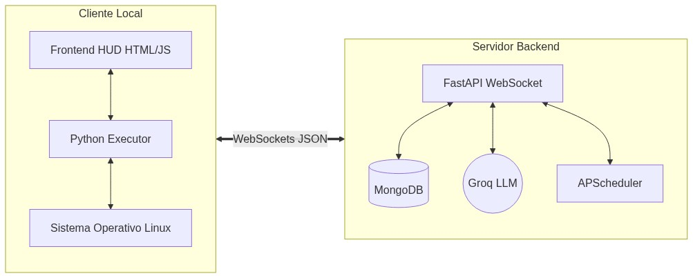
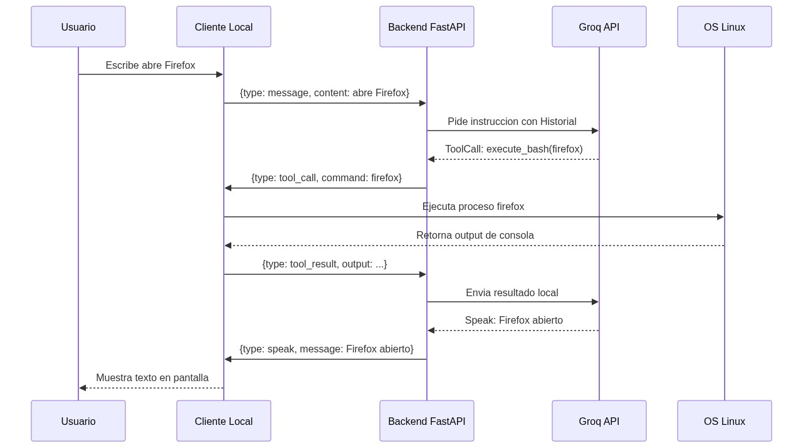

# Documentación Técnica de JARVIS

Esta documentación explica las entrañas del sistema y la arquitectura asíncrona sobre la que está construido.

## 1. Topología del Sistema
JARVIS es un sistema desacoplado, lo que significa que el "cerebro" está completamente separado del entorno del cliente. 

- **El Backend:** Un motor impulsado por `FastAPI`. Tiene conexión constante con bases de datos como `MongoDB` para la retención a largo plazo. Es el encargado de enviar el historial al modelo (LLM) y tomar decisiones sobre qué debe pasar a continuación.
- **El Cliente:** Una interfaz en Python, renderizando HTML/JS/CSS a través de `PyWebView`. Su única responsabilidad es estar conectado por `WebSockets` al backend, mostrar información en pantalla, y escuchar atajos de teclado globales.



## 2. Ejecución de Comandos (Tool Calling)
Cuando el usuario emite una instrucción (ej. "abre Firefox"), el flujo de ejecución es el siguiente:
1. Cliente envía el texto por WebSocket.
2. Backend lo procesa, consulta al LLM, y el LLM responde con una llamada a la herramienta `execute_bash`.
3. El Backend NO ejecuta esto (para evitar vulnerabilidades de inyección en el servidor). En cambio, le manda un mensaje al Cliente: `{"type": "tool_call", "command": "firefox"}`.
4. El Cliente lo ejecuta localmente con `subprocess.Popen`, captura la salida (`stdout/stderr`), y la manda de vuelta al Backend.
5. El Backend se lo entrega al LLM, quien finalmente genera una frase conversacional (`speak`).



## 3. Autonomía y Proactividad (APScheduler)
JARVIS cuenta con autonomía proactiva mediante la integración de `APScheduler` y el módulo `ConnectionManager`, lo que permite al servidor iniciar comunicaciones de forma independiente (Push messages).
Mediante el módulo `scheduler_service`, el LLM expone herramientas de ejecución del lado del servidor (ej. `schedule_reminder`).
Al solicitar la calendarización de una tarea, el sistema registra el evento en el `AsyncIOScheduler`. Una vez que expira el tiempo establecido, el proceso en segundo plano envía un evento WebSocket directo al cliente, demostrando un comportamiento asíncrono y proactivo.

## 4. Estructura de Directorios

```
jarvis/
├── backend/
│   ├── app/
│   │   ├── api/websockets/chat.py      # Gestor WS y lógica de enrutamiento
│   │   ├── core/config.py              # Variables de entorno cargadas con Pydantic
│   │   ├── models/schemas.py           # Modelos Pydantic para tipado estricto JSON
│   │   ├── services/
│   │   │   ├── connection_manager.py   # Registro de WS activos
│   │   │   ├── llm_service.py          # Groq LLM logic, Tools, y Rate Limit rotativo
│   │   │   ├── memory_service.py       # MongoDB Chat History
│   │   │   └── scheduler_service.py    # APScheduler Background tasks
│   │   └── main.py                     # Entry point y lifespan events
│   └── requirements.txt
├── client/
│   ├── web/                            # Frontend assets (HTML, JS, CSS)
│   ├── img/                            # Capturas de pantalla y multimedia
│   ├── connection.py                   # Motor WS cliente
│   ├── executor/executor.py            # Analizador del JSON recibido del Backend
│   ├── main.py                         # UI, Bandeja del sistema, Hotkeys y PyWebView
│   └── repl.py                         # Motor seguro de bash execution local
├── .env                                # Claves (No subido al repo)
├── .env.example
├── .gitignore
├── DOCUMENTATION.md
└── README.md
```
