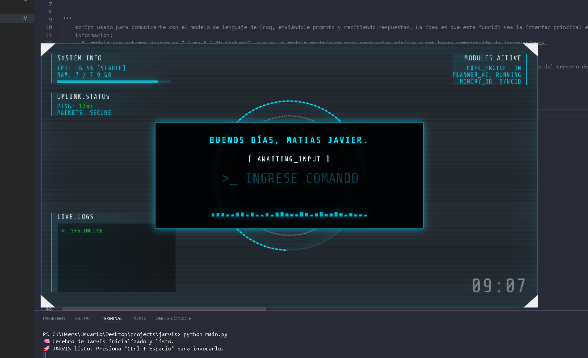
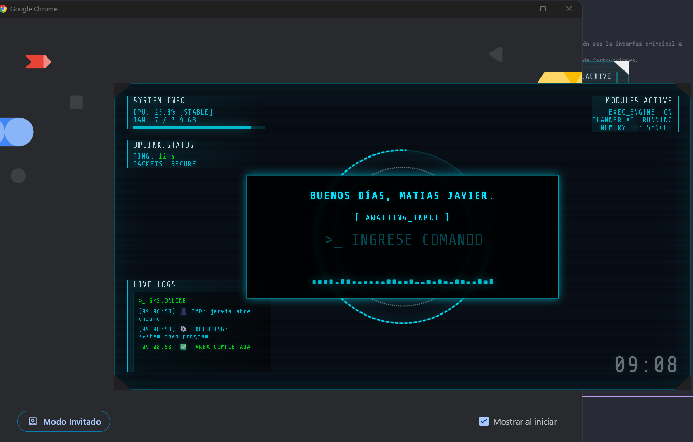
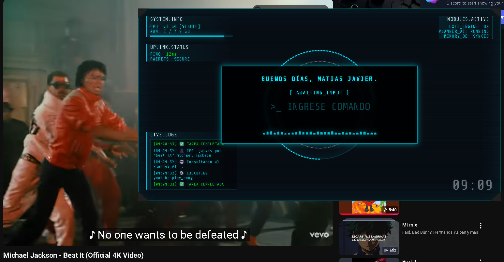
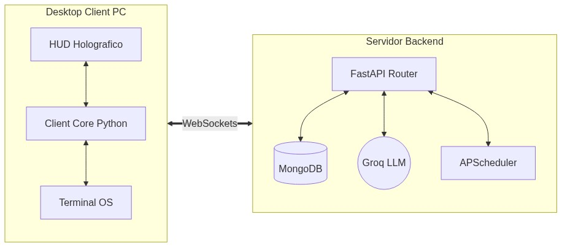

# JARVIS: Asistente de Escritorio Autónomo

JARVIS es un sistema de Asistencia e Inteligencia Artificial de grado AGI, diseñado con una arquitectura robusta de **Cliente-Servidor (Backend)** y capacidades autónomas. Puede controlar tu entorno de escritorio, agendar tareas por su cuenta e interactuar visual y auditivamente.

---

## Features Principales

### Autonomía Proactiva y Calendarización Asíncrona
El núcleo del asistente incorpora un motor de tareas en segundo plano basado en `APScheduler`. Esto le otorga al LLM la capacidad de invocar llamadas a herramientas (Tool Calls) del lado del servidor para programar eventos en el futuro. Cuando el temporizador expira, el backend inicia una comunicación WebSocket (Push Event) hacia el cliente para notificar al usuario de forma autónoma, simulando proactividad sin requerir un prompt inicial del usuario.

### Ejecución de Comandos a Nivel de Sistema (Bash REPL)
El cliente local actúa como un puente de hardware y software, permitiendo la interacción directa con el sistema operativo (Linux). Mediante un subproceso de Bash administrado por `asyncio.create_subprocess_exec`, el agente puede:
- Modificar el sistema de archivos.
- Interactuar con gestores de paquetes y configuraciones.
- Iniciar y controlar aplicaciones de interfaz gráfica.
- Monitorear en tiempo real métricas vitales (uso de CPU y memoria RAM).

### Arquitectura de Redundancia y Manejo de Rate Limits
Para garantizar la operación continua sin interrupciones por límites de cuota (HTTP 429), la capa de integración LLM implementa un patrón de rotación. El sistema acepta múltiples API Keys de Groq. Ante una respuesta de limitación, el servicio cambia automáticamente al siguiente cliente disponible en el arreglo de llaves, mitigando los tiempos de inactividad.

### Persistencia de Memoria y Contexto a Largo Plazo
Todas las sesiones de WebSocket, incluyendo metadatos de Tool Calls y comandos ejecutados, se guardan en un clúster de MongoDB utilizando el driver asíncrono `Motor`. El mecanismo de retención emplea una técnica de "Sliding Window" que inyecta los últimos N mensajes en el prompt base, proporcionando memoria contextual sin exceder la ventana de tokens del LLM.

### Interceptor de Seguridad de Ejecución
Como salvaguarda ante operaciones destructivas generadas por el LLM, el cliente evalúa todos los comandos de Bash contra una lista heurística de operaciones de alto riesgo (ej. `rm -rf`, `chmod`, `mkfs`). Si se detecta una coincidencia, el hilo de ejecución se pausa mediante `asyncio.Event` y renderiza un modal en el HUD solicitando autorización explícita del operador humano.

---

## Interfaz de Usuario (HUD)

El cliente de escritorio cuenta con un Head-Up Display (HUD) estilo holográfico que te muestra en tiempo real las acciones que JARVIS ejecuta en tu máquina, inspirado en el diseño premium y de alta tecnología.


*El cliente listo para recibir órdenes, monitoreando el estado vital de la PC (RAM/CPU).*


*Visualización de respuestas, notificaciones proactivas y decisiones del sistema.*


*Output visual de las acciones y confirmaciones de seguridad.*

---

## Arquitectura del Sistema

El sistema está dividido estrictamente en dos partes para garantizar máxima seguridad y escalabilidad:



1. **Backend**: Un servidor FastAPI que maneja la memoria, el LLM (Groq), el enrutamiento de peticiones, la rotación de API Keys y un motor interno de tareas asíncronas (`APScheduler`). Nunca ejecuta comandos en el servidor.
2. **Client**: Una aplicación de Python (PyWebView + HTML/JS/CSS) que reside en la estación de trabajo local. Recibe comandos por WebSocket del Backend, los ejecuta en el sistema operativo local y envía los resultados de vuelta al servidor.

Para mayor profundidad sobre el diseño interno, referirse al documento: [DOCUMENTATION.md](DOCUMENTATION.md)

---

## Tecnologías Utilizadas

*   **Backend**: Python, FastAPI, Uvicorn, Motor (Async MongoDB), APScheduler, Pydantic, Groq API (Llama-3.3-70b-versatile).
*   **Client**: Python, PyWebView, Asyncio, WebSockets, Pynput (Hotkeys).
*   **Frontend (HUD)**: Vanilla JS, CSS3 Avanzado (Glassmorphism, animaciones), HTML5.

---

## Instalación y Despliegue

### 1. Variables de Entorno
Copia el archivo de ejemplo y complétalo:
```bash
cp .env.example .env
```
Añade tus API Keys de Groq (puedes poner varias separadas por coma) y tu URI de conexión a MongoDB.

### 2. Iniciar el Backend
Desde la carpeta raíz del proyecto, en un terminal (con el entorno virtual activado):
```bash
cd backend
pip install -r requirements.txt
uvicorn app.main:app --reload
```

### 3. Iniciar el Cliente HUD
En otra terminal diferente:
```bash
cd client
pip install -r requirements.txt
python main.py
```

Presiona `Ctrl + Espacio` en cualquier momento en tu escritorio para invocar el HUD holográfico de JARVIS.

---

## Historial de Versiones

| Versión | Fecha | Descripción |
| :--- | :--- | :--- |
| **v2.0.0** | Agosto 2026 | Refactorización masiva a arquitectura Cliente-Servidor (FastAPI + PyWebview). Incorporación de Autonomía proactiva (APScheduler), rotación de API Keys, MongoDB para memoria a largo plazo y WebSockets persistentes. |
| **v1.5.0** | Julio 2026 | Mejoras en el HUD Holográfico con Vanilla CSS. Añadidos atajos de teclado (`Ctrl + Espacio`) globales y reportes del estado vital de CPU/RAM. |
| **v1.0.0** | Junio 2026 | Versión inicial. Script monolítico básico capaz de ejecutar comandos Bash localmente mediante Groq. |

---

*Desarrollado para optimizar la productividad y automatización en el entorno de escritorio.*
